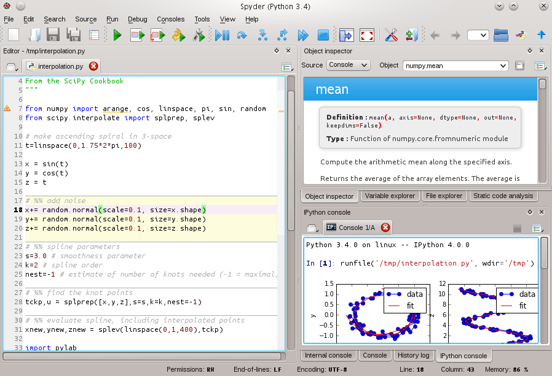

# Spyder - The Scientific PYthon Development EnviRonment

Copyright © 2009- The Spyder Development Team.

## Overview

Spyder is a Python development environment with a lot of features:

* **Editor**

    Multi-language editor with function/class browser, code analysis
    features (pyflakes and pylint are currently supported), code
    completion, horizontal and vertical splitting, and goto definition.

* **Interactive console**

    Python or IPython consoles with workspace and debugging support to
    instantly evaluate the code written in the Editor. It also comes
    with Matplotlib figures integration. 

* **Documentation viewer**

    Show documentation for any class or function call made either in the
    Editor or a Console.

* **Variable explorer**

    Explore variables created during the execution of a file. Editing
    them is also possible with several GUI based editors, like a
    dictionary and Numpy array ones.

* **Find in files**

    Supporting regular expressions and mercurial repositories

* **File explorer**

* **History log**

Spyder may also be used as a PyQt4/PySide extension library (module 
`spyderlib`). For example, the Python interactive shell widget used in
Spyder may be embedded in your own PyQt4/PySide application.

## Documentation

You can read the Spyder documentation at:

http://pythonhosted.org/spyder/

## Installation

This section explains how to install the latest stable release of
Spyder. If you prefer testing the development version, please use
the `bootstrap` script (see next section).

The easiest way to install Spyder is:

### On Windows:

- Or using one of these scientific Python distributions:
  1. [Anaconda](http://continuum.io/downloads)
  2. [WinPython](https://winpython.github.io/)
  3. [Python(x,y)](http://pythonxy.googlecode.com)
- Using one of our executable installers, which can be found
  [here](https://github.com/spyder-ide/spyder/releases).

### On Mac OSX:

- Using our DMG installer, which can be found
  [here](https://github.com/spyder-ide/spyder/releases).
- Using the [Anaconda Distribution](http://continuum.io/downloads).
- Through [MacPorts](http://www.macports.org/).

### On GNU/Linux

- Through your distribution package manager (i.e. `apt-get`, `yum`,
  etc).
- Using the [Anaconda Distribution](http://continuum.io/downloads).
- Installing from source (see below).

### Cross-platform way from source

You can also install Spyder with the `pip` package manager, which comes by
default with most Python installations. For that you need to use the
command:

    pip install spyder

To upgrade Spyder to its latest version, if it was installed before, you need
to run

    pip install --upgrade spyder

For more details on supported platforms, please refer to our
[installation instructions](http://pythonhosted.org/spyder/installation.html).

**Important note**: This does not install the graphical Python libraries (i.e.
PyQt4, PyQt5 or PySide) that Spyder depend on. Those have to be installed
separately after installing Python.

## Running from source

The fastest way to run Spyder is to get the source code using git, install
PyQt4, PyQt5 or PySide, and run these commands:

1. `pip install qtawesome` or `conda install -c spyder-ide qtawesome`
2. `cd /your/spyder/git-clone`
3. `python bootstrap.py`

You may want to do this for fixing bugs in Spyder, adding new
features, learning how Spyder works or just getting a taste of it.

## Dependencies

**Important note**: Most if not all the dependencies listed below come
with *Anaconda*, *WinPython* and *Python(x,y)*, so you don't need to install
them separately when installing one of these Scientific Python
distributions.

### Build dependencies

When installing Spyder from its source package, the only requirement is to have
a Python version greater than 2.7 (Python 3.2 is not supported anymore).

### Runtime dependencies

* **Python** 2.7 or 3.3+
* **PyQt4** 4.6+, **PyQt5** 5.2+ or **PySide** 1.2.0+: PyQt4 is recommended.
* **IPython** 3.0 or **qtconsole**: Enhanced Python interpreter.
* **Rope** and/or **Jedi** 0.8.1: Editor code completion, calltips
  and go-to-definition.
* **Pyflakes**: Real-time code analysis.
* **Sphinx**: Object Inspector's rich text mode.
* **Pygments**: Syntax highlighting for all file types it supports.
* **Pylint**: Static code analysis.
* **Pep8**: Style analysis.
* **Psutil**: CPU and memory usage on the status bar.
* **Nbconvert**: Manipulation of notebooks in the Editor.

**Note**: To get IPython in Ubuntu you need to install `ipython-qtconsole`,
on Fedora `ipython-gui` and on Gentoo `ipython` with the `qt4` USE flag.

### Optional modules

* **Matplotlib**: 2D/3D plotting in the Python and IPython consoles.
* **Pandas**: View and edit DataFrames and Series in the Variable Explorer.
* **Numpy**: View and edit two or three dimensional arrays in the Variable Explorer.
* **SymPy**: Symbolic mathematics in the IPython console.
* **SciPy**: Import Matlab workspace files in the Variable Explorer.

## More information

* For code development please go to:

    <https://github.com/spyder-ide/spyder>

* For bug reports and feature requests:

    <https://github.com/spyder-ide/spyder/issues>

* For discussions and troubleshooting:

    <http://groups.google.com/group/spyderlib>
